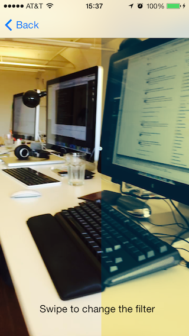
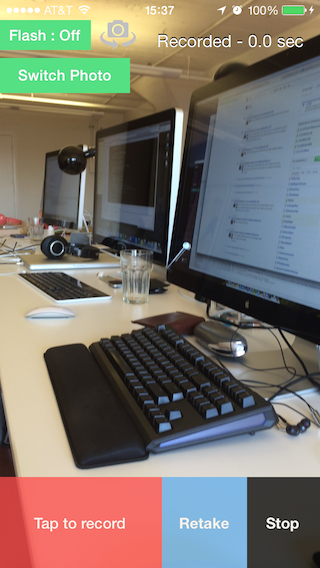

SCRecorder
===============

     

A Vine/Instagram like audio/video recorder and filter framework in Objective-C.

In short, here is a short list of the cool things you can do:
- Record multiple video segments
- Remove any record segment that you don't want
- Display the result into a convenient video player
- Save the record session for later somewhere using a serializable NSDictionary (works in NSUserDefaults)
- Add a video filter using Core Image
- Merge and export the video using fine tunings that you choose


Examples for iOS are provided.

Want something easy to create your filters in this project? Checkout https://github.com/rFlex/CoreImageShop

Framework needed:
- CoreVideo
- AudioToolbox
- GLKit

Podfile
----------------

If you are using cocoapods, you can use this project with the following Podfile

```ruby
	platform :ios, '7.0'
	pod 'SCRecorder'
```

Getting started
----------------

SCRecorder is the main class that connect the inputs and outputs together. It will handle all the underlying AVFoundation stuffs.

```objective-c
// Create the recorder
SCRecorder *recorder = [SCRecorder recorder]; // You can also use +[SCRecorder sharedRecorder]
	
// Set the sessionPreset used by the AVCaptureSession
recorder.sessionPreset = AVCaptureSessionPresetHigh;
	
// Listen to some messages from the recorder!
recorder.delegate = self;
	
// Initialize the audio and video inputs using the parameters set in the SCRecorder
[recorder openSession: ^(NSError *sessionError, NSError *audioError, NSError *videoError, NSError *photoError) {
	// Start the flow of inputs
	[recorder startRunningSession];
}];
```

Configuring the recorder
--------------------

You can configure the video, audio and photo output settings in their configuration instance that you can access just like this:
```objective-c

// Get the video configuration object
recorder.videoConfiguration;

// Get the audio configuration object
recorder.audioConfiguration;

// Get the photo configuration object
recorder.photoConfiguration;
```

You can configure the input settings (framerate of the video, whether the flash should be enabled etc...) directly on the SCRecorder.
```objective-c

recorder.sessionPreset = AVCaptureSessionPresetHigh;
recorder.device = AVCaptureDevicePositionFront;

```
	
Begin the recording
--------------------

The second class we are gonna see is SCRecordSession, which is the class that process the inputs and append them into an output file. A record session can contain multiple record segments. A record segment is just a continuous video and/or audio file, represented as a NSURL. It starts when you hold the record button and end when you release it, if you implemented the record button the same way as instagram and vine did. A call of [SCRecorder record] starts a new record segment if needed.

```objective-c
// Creating the recordSession
SCRecordSession *recordSession = [SCRecordSession recordSession];

recorder.recordSession = recordSession;
	
[recorder record];
```	

Finishing the record and editing
---------------------

When you are done recording, you need to pause the SCRecorder. Each call of -[SCRecorder pause] causes the current record segment to be completed and appended as a NSURL that is available through the -[SCRecordSession recordSegments] array. You can then read the record segments using -[SCRecordSession assetRepresentingRecordSegments]. You can also read each individual file by using one of the NSURL entry inside the recordSegments array.

```objective-c
// When done with the current record segment
[recorder pause:^{ 
	SCRecordSession *recordSession = recorder.recordSession;

	// Removing segments
	[recordSession removeSegmentAtIndex:0 deleteFile:YES]; // Remove first segment
	[recordSession removeLastSegment]; // Remove lastsegment

	// Read the record segment
	SCPlayer *player = ...; // Get instance of SCPlayer
	[player setItemByAsset:recordSession.assetRepresentingRecordSegments];
	[player play];
	
	// Play the video with a black and white filter
	SCImageView *SCImageView = ...; // Get instance of SCImageView
	player.CIImageRenderer = SCImageView;
	SCImageView.filterGroup = [SCFilterGroup filterGroupWithFilter:[SCFilter filterWithName:@"CIPhotoEffectNoir"]];
}];
```

Merging all the record segments into one file
---------------------

Once you are done editing your record session, you can merge the record segments into one file that you can upload to your server and store locally. You can either go the easy way with few customization using -[SCRecordSession mergeRecordSegmentsUsingPreset: completionHandler:], or you can use the asset returned by -[SCRecordSession assetRepresentingRecordSegments] and export yourself using the native AVAssetExportSession, the more customizable with filter support SCAssetExportSession, or an exporter that you implemented yourself.

```objective-c

SCRecordSession *recordSession = ...;

// Easy way
recordSession mergeRecordSegmentsUsingPreset:AVAssetExportSessionPresetHighest completionHandler:^(NSURL *outputUrl, NSError *error) {
	if (error == nil) {
		// File recorded to outputUrl
	}
}];

// With more customization
AVAsset *asset = [recordSession assetRepresentingRecordSegments];

SCAssetExportSession assetExportSession = [[SCAssetExportSession alloc] initWithAsset:asset];
assetExportSession.filterGroup = [SCFilterGroup filterGroupWithFilter:[SCFilter filterWithName:@"CIPhotoEffectInstant”]];
assetExportSession.outputUrl = recordSession.outputUrl;
assetExportSession.outputFileType = AVFileTypeMPEG4;
assetExportSession.sessionPreset = SCAssetExportSessionPresetHighestQuality;
assetExportSession.keepVideoSize = YES;
[assetExportSession exportAsynchronouslyWithCompletionHandler: ^{
	if (assetExportSession.error == nil) {
		// We have our video and/or audio file
	} else {
		// Something bad happened
	}
}];

```

Creating/manipulating filters
---------------------

SCRecorder comes with a filter API built on top of Core Image. SCFilter is the class that wraps a CIFilter. It can have a delegate to know when a filter parameter has changed and is compliant to NSCoding. Even though CIFilter is also NSCoding compliant, SCFilter was needed because it fixed some incompatibility issue while trying to deserialise a CIFilter on iOS that was serialised on OS X. SCFilterGroup is a class that contains a list of SCFilter. SCFilterGroup can be saved directly into a file and restored from this file. Using the CoreImageShop Mac project, you can create SCFilterGroup’s and use them on your iOS app.  

```objective-c

// Manually creating a filter chain
SCFilter *blackAndWhite = [SCFilter filterWithName:@"CIColorControls"];
[blackAndWhite setParameterValue:@0 forKey:@"inputSaturation"];

SCFilter *exposure = [SCFilter filterWithName:@"CIExposureAdjust"];
[exposure setParameterValue:@0.7 forKey:@"inputEV"];

SCFilterGroup *filterGroup = [SCFilterGroup filterGroupWithFilters:@[blackAndWhite, exposure]];

// Saving to a file
NSError *error = nil;
[filterGroup writeToFile:[NSURL fileUrlWithPath:@"some-url.cisf"] error:&error];
if (error == nil) {

}

// Restoring the filter group
SCFilterGroup *restoredFilterGroup = [SCFilterGroup filterGroupWithContentsOfUrl:[NSURL fileUrlWithPath:@"some-url.cisf"]];
```

Using the filters
---------------------

SCFilterGroup can be either used in a view to render a filtered image in real time, or in a processing object to render the filter to a file. You can use an SCFilterGroup in one of the following classes:

- SCAssetExportSession (processing)
- SCVideoConfiguration (processing)
- SCImageView (live rendering)
- SCSwipeableFilterView (live rendering)


Some details about the other provided classes
---------------------

#### SCRecorderFocusView

Simple view that can have an SCRecorder instance. It will handle the tap to focus. SCRecorder delegate can call -[SCRecorderFocusView showFocusAnimation] and -[SCRecorder hideFocusAnimation] to show and hide the animation when needed.

#### CIImageRenderer (protocol)

Every class that conforms to this protocol can render a CIImage.

#### SCImageView<CIImageRenderer>

A simple CIImageRenderer view that can have a SCFilterGroup. It renders the input CIImage using the SCFilterGroup, if there is any.

#### SCSwipeableFilterView<CIImageRenderer>

A CIImageRenderer view that has a scroll and a list of SCFilterGroup. It let the user scrolls between the filters so he can chose one. The selected filter can be retrieved using -[SCSwipeableFilterView selectedFilterGroup]. This basically works the same as the Snapchat composition page.

#### SCAssetExportSession

Exporter that has basically the same API as the Apple AVAssetExportSession but adds more control on the output quality. It can also have a SCFilterGroup so each image buffer are processed using that filter group.

#### SCPlayer

Player based on the Apple AVPlayer. It adds some convenience methods and the possibility to have a CIImageRenderer that will be used to render the video image buffers. You can combine this class with a CIImageRenderer to render a live filter on a video.

#### SCVideoPlayerView

A view that render an SCPlayer easily. It supports tap to play/pause. By default, it holds an SCPlayer instance itself and share the same lifecycle as this SCPlayer. You can disable this feature by calling +[SCVideoPlayerView setAutoCreatePlayerWhenNeeded:NO].
